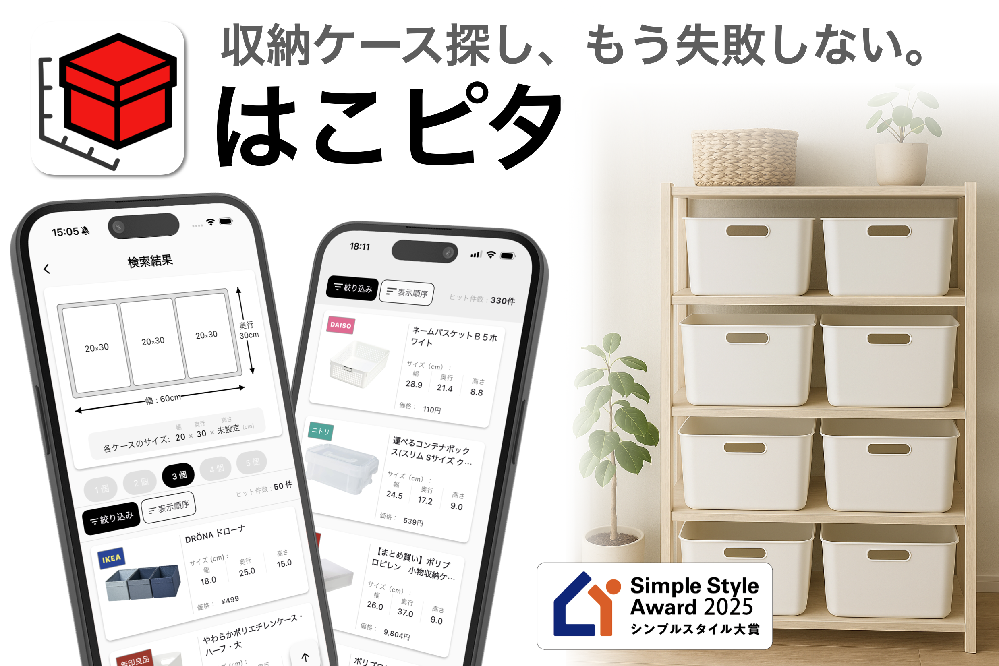

# はこピタ

<!--  -->

「はこピタ」は、収納ケースや棚をサイズ・素材・色などの条件で検索・比較できるモバイルアプリです。  
ニトリ、無印良品、DAISOなど複数のブランドやECサイトの商品をまとめて一括検索でき、自宅の収納スペースにぴったりのアイテムを見つけることができます。

**ストアリンク**: [AppStore](https://apps.apple.com/jp/app/id1644135792), [GooglePlay](https://play.google.com/store/apps/details?id=net.ddns.rtapps.hako_pita)

---

## 着眼した課題

注文住宅の新築時、間取り検討や引っ越しを通じて収納を考える中で、**収納スペースにぴったりな収納ケースを探すのに苦労した経験**がありました。
- 棚の奥行きや高さが合わず、買ったけれど入らなかった
- 収納ケースを買いに行っても、自宅のスペースのサイズを思い出せなかった
- 実店舗やECサイトを回らないと、サイズや材質の違いを比較できなかった

このことから **「自分にあった収納商品をもっと簡単に見つけられたら」** と強く感じました。  
SNS等で調べると、多くの方が同じ悩みを持っていることがわかりましたが、当時この悩みを解決できるようなサービスは見つけられませんでした。  

---

## 解決アプローチ

そこで、**自分の収納スペースに最適な収納アイテムを簡単に見つけ・購入できるアプリ**を開発しました。
はこピタでは、以下の機能により、商品選びから購入までを完結できます。
- 棚や押入れなど、自分の収納スペースを写真・サイズ・メモ付きで記録
- 記録したサイズをもとに、複数ブランドの収納アイテムを一括検索・比較
- 気になるアイテムをお気に入り登録し、一覧で管理・比較
- ECサイトと連携し、気に入った収納アイテムをそのまま購入可能

---

## 技術構成と工夫点

### フロントエンド
- Flutter/Dartでクロスプラットフォーム開発（iOS / Android）

### バックエンド
- Python / FastAPIで商品検索機能を実装しています
- AWS（API Gateway, Lambda, RDS）を利用しています
- OpenAI API・VLMを活用し、収納アイテムの説明文・画像から、色や素材、収納ケースの特徴(引き出しや仕切り有無)情報を自動生成しています
- GitHub Actionsを活用したCI/CDにより、開発〜デプロイまでを効率化しています

#### バックエンドのシステム概要図

#### 参考：バックエンドのサンプルコード ###
[HakoPita FastAPI](https://github.com/remma-takeuchi/hakopita_fast_api)  
※ 認可・認証などは省いたサンプルコードです。

### 分析・運用
- Firebase Analytics / Remote Config によるユーザー行動分析と A/B テスト
- RevenueCat によるサブスクリプション管理・収益化
- AdMob による広告収益化

---

## グロースのための取り組み

- **機能追加・改善**
  - ユーザレビュー・問い合わせで寄せられる意見を参考に、継続的な機能追加・改善を実施
- **ASO（App Store Optimization）対策**
  - AppTweakツールを活用し、キーワード最適化・スクリーンショット改善を継続的に実施
- **SNS・インフルエンサー活用**
  - プロモーションコードを活用し、インフルエンサーによる投稿や、紹介ツイートによる自然拡散を促進
- **メディア・コンテスト活用**
  - テレビ・雑誌などのメディア取材や、シンプルスタイル大賞などの公式コンテストへの参加を通じて、第三者視点での信頼性・認知度向上を推進

---

## 成果と反響

- **累計ダウンロード：70万超**
- **月間アクティブユーザー：約9万人**
- **App Store**
  - 日本AppStoreで最高総合ランク#3、ショップカテゴリランク#2を獲得
  - レビュー数2,000件以上、平均★4.2以上の高評価で、「無駄な買い物が減った」などの声も多数寄せられています。
- **[シンプルスタイル大賞 2025 金賞受賞](https://housekeeping.or.jp/simple_style/simplestyle-2025/)**
  - ハウスキーピング協会主催の全国コンテスト
  - 全国の整理収納アドバイザー20万人の投票により、金賞に選出されました
- **複数のメディア（テレビ・雑誌）からの取材・掲載実績多数あり**
  - [フジテレビ 「めざましテレビ」（2024年4月9日放送回）](https://mezamashi.media/articles/-/6928)
  - フジテレビ 「ぽかぽか」（2024年7月23日放送回）
  - 関西テレビ放送 「土曜はナニする⁉」（2024年9月28日放送回）

---

## 今後の展望

今後は日本国内の利用者だけでなく、アメリカ（リリース済み）や韓国など**海外市場での展開**に注力します。  
また、検索結果の精度向上やレコメンド強化のため、引き続きAI技術やユーザー行動データを活用した改善にも注力していきます。
